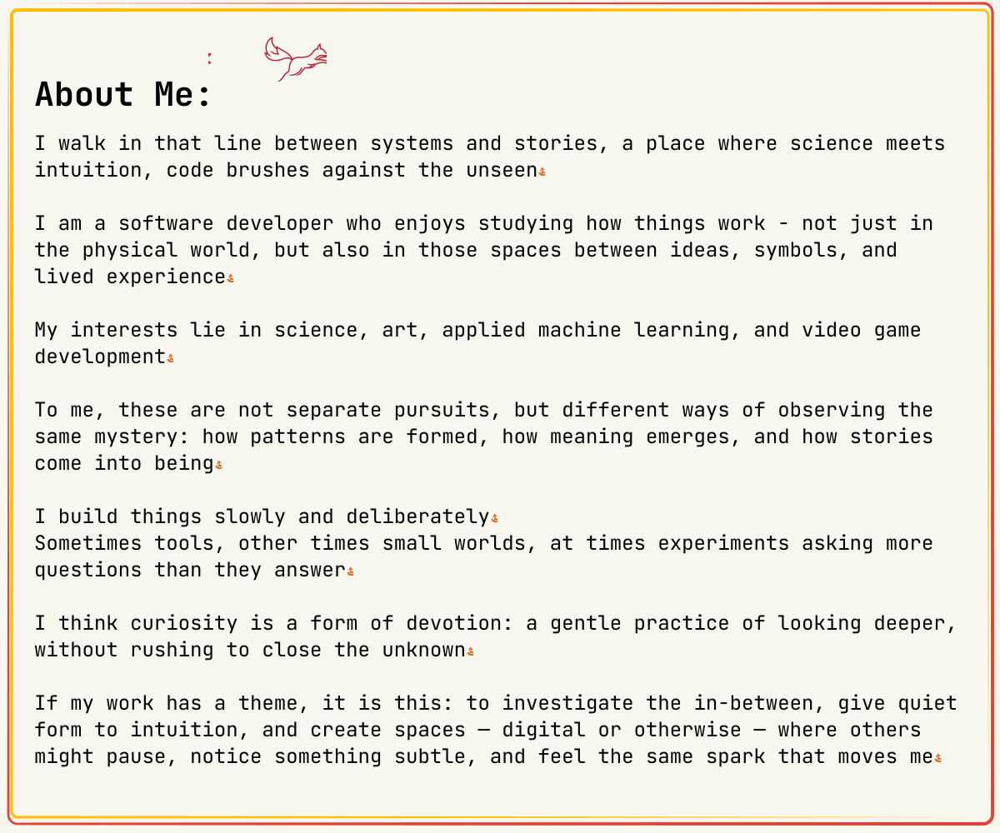

<!-- Abusing SVG files to get background images and textures/pixel perfect alignment becuase github dosen't support css-->

<!-- Profile header -->
<picture>
    <source media="(prefers-color-scheme: dark)" srcset="./img/Profile_header_dark.svg">
    
</picture>

<!-- Socials/Contacts -->
<!-- I want to center these SOOOO BAD but every time I've tried it's broken them :( -->
  

<!-- About me -->
<picture>
    <source media="(prefers-color-scheme: dark)" srcset="./img/About_me_dark.svg">
    
</picture>
  

<!-- GitHub Stats -->
<b> GitHub Stats: </b>
<!-- Why does github put a big gap here? it like x4  !! -->
<picture>
    <source media="(prefers-color-scheme: dark)" srcset="https://github-readme-stats-prod-two.vercel.app/api?username=Jwilson1172&theme=default&hide_border=true&bg_color=1a1b27&text_color=c8d3f5&icon_color=ffb454&title_color=ff757f&count_private=false&show_icons=true">
    
</picture>

<!-- Hide languages and tools by defualt -->
<b>Languages and Tools:</b>
<!-- uuuuggghhh fine I won't use a detail panel to hind this mess -->

<picture>
    <source media="(prefers-color-scheme: dark)" srcset="https://github-readme-stats-prod-two.vercel.app/api/top-langs?username=Jwilson1172&theme=default&hide_border=true&bg_color=1a1b27&text_color=c8d3f5&icon_color=ffb454&title_color=ff757f&layout=compact&show_icons=true">
    
</picture>
     
    <code></code>
    <code></code>
    <code></code>
     
    <code></code>
    <code></code>
    <code></code>
     
    <code></code>
    <code></code>
    <code></code>
     
    <code></code>
    <code></code>
    <code></code>

 
If you are interested I do also have WIP blog. It's ... a template ATM but if you want to bookmark it and checkback periodically I'm sure you might find things have changed.
 
<a href="https://jwilson1172.github.io/">Personal Blog</a>

